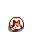

# 🐱🐱 Kitten 🐱🐱


A lightweight and adorable desktop virtual pet cat. It will roam freely on your desktop, play, sleep, and keep you company during your work or study time, bringing a touch of relaxation and delight.

## Preview


## Feature
- **Adorable Interactions**: The kitten has multiple states, including walking, stretching, napping.
- **Desktop Roaming**: It intelligently moves around the edges of your screen without interrupting your work.
- **Low Resource Usage**: Built with Java **Swing**, it uses minimal system resources.
- **Cross-Platform**: Supports Windows, macOS and Linux.


## Quick Start
### Prerequisites
- Java 21

## Installation & Running
### **Download from releases**
### or
### **Build from source**
```cmd
    git clone https://github.com/curtishd/Kitten.git
    cd Kitten
    .\gradlew.bat build
    .\gradlew.bat copyDependencies
    cp .\build\resources\main .\build\classes\kotlin\ -r -Force
```

**Run the application**
```cmd
    java -p ".\build\libs;.\build\classes\kotlin" -m me.cdh/me.cdh.MainKt 
```

### or

### **CI/CD**
Fork the repo.
This project uses GitHub Actions for continuous integration and deployment. The workflows are defined in the .github/workflows/ directory.
**CI** Runs on every push to the main branch.

### Viewing CI Results
1. Go to the "Actions" tab in your
2. Click on a specific workflow run to see detailed logs for each job and step.
3. A green checkmark indicates a successful run, while a red cross indicates a failure.
4. After CI complete, a local executable is generated. Just download and run as usual.
## How to Use
- **Interact**: Try clicking or dragging the kitten with your mouse to see its reactions!

- **Ignore It**: Don't worry, it will entertain itself happily without getting in your way.

PS: Art resources copyright from Stardew Valley
