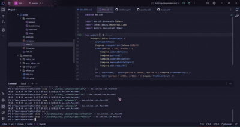

# 🐱🐱 Catppuccino 🐱🐱


A lightweight and adorable desktop virtual pet cat. It will roam freely on your desktop, play, sleep, and keep you
company during your work or study time, bringing a touch of relaxation and delight.

## Preview




## Feature

- **Adorable Interactions**: The kitten has multiple states, including walking, stretching, napping.
- **Desktop Roaming**: It intelligently moves around the edges of your screen without interrupting your work.
- **Low Resource Usage**: Built with Java **Swing**, it uses minimal system resources.
- **Cross-Platform**: Supports Windows, macOS and Linux.
- **Four Skins Are Randomly Selected**: calico cat, grey tabby cat, orange cat and white cat.

## Quick Start

### Prerequisites

- Java 21

## Installation & Running

### **Download from releases**

### or

**Run the application**

```cmd
    # powershell
    .\gradlew.bat run
    # bash
    ./gradlew run
```

## How to Use

- **Interact**: Try clicking or dragging the kitten with your mouse to see its reactions!

- **Ignore It**: Don't worry, it will entertain itself happily without getting in your way.

Enjoy!

PS: Art resources copyright from Stardew Valley

